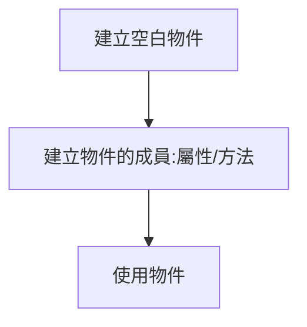

# 基礎Web開發筆記

## 標準基礎架構

標籤|說明
---|---|
`<head>`|網頁的描述
`<title>`|網頁的標題
`<body>`|整份網頁的內容
`
`|區塊(會產生斷行效果)
`style`|設定 HTML 文件的樣式
``|行內標定修改處(不會產生斷行效果)
` `|主動斷行
`<h3>`|3號標題，數字越大層級越高，字體越大
``|圖片
`<ul>`|列表
`<li>`|列表中的項目
`<a>`|超連結
`<table>`|建立表格
`<tr>`|表格列
`<td>`|表格欄
`<b>`|粗體
`<u>`|底線
`<meta>`|用來提供網頁內容的資訊給瀏覽器或是搜尋引擎

屬性|說明
---|---|
`style`|`width`給邊框設寬度
^|`padding`填色，使邊框與文字產生距離
^|`border`設定邊框的寬度、樣式、顏色
^|`margin`代表兩個區塊之間的距離
`img`|`src`圖片的來源位置
^|`al`圖片名稱
`<a>`|`href`超連結
`table`|`border`使格線(邊)出現
^|`width`表格寬
^|`cellpadding`表格內容與邊界增加多少像素
`<meta>`|`charset`設定網頁編碼
`style`|`font-weight`文字粗細
^|`font-size`文字大小
^|`position:relative`&`position:absolute`設定相對、絕對位置

### 基本架構(巢狀的標籤組成)如下

    <!DOCTYPE html>
    <html>
    <head>                            //網頁的描述
        <meta charst="utf8"/>        //網頁按utf8編碼進行，使中文可以正確顯示
        <title></title>              //網頁的標題
        
    </head>
    <body>
    <h3>自我介紹</h3>
    
大家好

    <h3>連結</h3>
    <ul>
        <li></li>
        <li></li>
    </ul>
    <h3>作品集<h3>
    <ul>
        <li></li>
    </ul>
    </body>
    </html>

#### class選擇器

    <!DOCTYPE html>
    <html>
    <head>
        <meta charset="utf8"/>
        <title></title>
        
    </head>
    <body style="margin:0px"> //區塊與螢幕邊緣為0
        
關於我

        

        

        
基本資料

        
女性

        
台灣

        
職業

        

        

        
興趣

        

        

        
聯繫方式

        

    </body>
    </html>

[實作02](/02_basic_html/homework/training2.html)

[參考資料:網頁前端工程入門：網頁排版教學 By 彭彭](https://www.youtube.com/watch?v=YnSmOQF5Lwk&list=RDCMUCguZS-y7codLSt6vpkVdnKg&index=2
)

## CSS3 Flexbox排版

透過使用`flex`設定達到上一節先設定`margin-left/right:auto`，再設定`box:width`&`margin`&`padding`像素，最後再設定`display:inline-block`&`vertical-align:top`。
具體方法為以下

先處理***並排(切欄)*** :容器設定顯示模式`display:flex`；項目設`flex:none`並給寬度

再處理***水平對齊*** :容器設定`justify-content`

最後處理***垂直對齊*** :容器設定`align-items:stretch`

    <!DOCTYPE html>
    <html>
    <head>
        <meta charset="utf-8"/>
        <title>Lesson 3</title>
        <link href="style.css" rel="stylesheet" type="text/css" media="all"/>
    </head>
    <body >
        <nav>
        
Logo

        
Menu

        
User

        </nav>
        <main>       //容器裝三個項目(
)
        
1 happy

        
2

        
3

        </main>
    </body>
    </html>

[實作03](/03_basic_html/homework/training3.html)

[參考資料:網頁前端工程入門：CSS3 Flexbox 排版基礎教學 By 彭彭](https://www.youtube.com/watch?v=CB-s9s1-r7Q&list=PL-g0fdC5RMbpqZ0bmvJTgVTS4tS3txRVp&index=7)

## Javascript基礎教學

標籤`
    </head>

[實作09](/09_basic_html/homework/training9.html)

[參考資料:網頁前端工程入門：Javascript 簡介 By 彭彭](https://www.youtube.com/watch?v=LI4ADR4JKyA&list=PL-g0fdC5RMbpqZ0bmvJTgVTS4tS3txRVp&index=9)

## 變數與運算子

資料:數字、字串`string`(需用雙隱號包裹)、布林值`ture`&`false`、物件。

變數:可將資料存放進來，像一個儲存庫。一個變數只能裝一個資料。

[運算子](C:\Users\三重田馥甄\Desktop\overview\README.md):單元運算、比較運算子

使用者輸入:`prompt`(提示語,預設值)-->程式運算-->輸出`alert`(資料)

[實作10](/10_basic_html/homework/training10.html)

[參考資料:網頁前端工程入門：Javascript 變數與運算子 By 彭彭](https://www.youtube.com/watch?v=pVXPcl2jFvw&list=PL-g0fdC5RMbpqZ0bmvJTgVTS4tS3txRVp&index=10)

## 流程控制-判斷式

1.if(判斷式:結果為布林值){

如判斷式的結果為true則執行這個{}內的function；如為否，則跳過這個{}內的function

}

2.if(判斷式){

如判斷式的結果為true則執行這個{}內的function；如為否，則跳過這個{}內的function執行else後面的function

}

else{

}

3.if(判斷式){

//先做第一次判斷，如為true，則執行此塊程式碼

}

else if(判斷式二){

//如第一次判斷為false，則做第二次判斷二，如為true，則執行此塊程式碼

}

else{

//如第二次判斷仍為false，則執行此塊程式碼

}

    var n1=prompt("請輸入數字","");
    var n2=prompt("請輸入數字","");
    var op=prompt("請輸入運算:+,-,*,/","");
    n1=Number(n1);n2=Number(n2) //字串轉數字的轉換
    var result;
    if(op=="+"){
        result=n1+n2;
    }
    else if(op == "-"){
        result=n1-n2;
    }
    else if(op=="*"){
        result=n1*n2;
    }
    else if(op =="/"){
    result=n1/n2;
    }
    else{
        result="無效的輸入符號";
    }
    alert(result);

[實作11](/11_basic_html/homework/training11.html)

[參考資料:網頁前端工程入門：Javascript 流程控制 - 判斷式 By 彭彭](https://www.youtube.com/watch?v=LIgMGq0YRPE&list=PL-g0fdC5RMbpqZ0bmvJTgVTS4tS3txRVp&index=11)

## 流程控制-迴圈

1.while(判斷){

//若判斷結果為正確的(true)，執行{}中的程式碼。
程式碼執行完畢，回到上方while的位置，做第二次判斷，直到判斷結果為錯誤的(false)，才跳離整個迴圈結構}

例一

    while(true){
    alert("hello,world");  //無窮迴圈
    }

例二

    var n=1; sum=0;
    while(n<=5){
    sum=sum+n; //sum+=n /*1st sum=1 n=2 ;2nd sum=3 n=3;3rd sum=6  n=4;4th sum=10 n=5;5th sum=15 n=6*/
    n++; //1+2+3+4+5=15
    }
    alert(sum);
2.for(初始區塊;判斷;迴圈區塊){

判斷概念同while迴圈。}

    var sum=0;
    for(var i=1;i<=100;i++){
        sum=sum+i;
    }
    alert(sum);

搭配使用`break;`強制跳出迴圈;`continue`強制進行下一次的迴圈

例一

    var n=0;
    while(n<=100){
    if(n == 50){
        break;
    }
    n++; //50th n=50 51th=>true=>break =>n=50
    }
    alert(n);

例二

    var x=0;
    for(var i=0;i<=100;i++){
    if(i%4 == 0 ){  //i能被4整除(沒有餘數)
        continue;//強制直接重頭進行
    }
    x++;
    }
    alert(x);/*100中能被4整除的數字有25個，當整除時continue會強制重頭進行，故x不進行+1；每進行一次x就+1，進行100次其中25次沒有運行到最後，故x=75*/

[實作](/12_basic_html/homework/training12.html)

[參考資料:網頁前端工程入門：Javascript 流程控制 - 迴圈 By 彭彭](https://www.youtube.com/watch?v=uvLMIXuuc-8&list=PL-g0fdC5RMbpqZ0bmvJTgVTS4tS3txRVp&index=12)

## 函式

內建函式:如`alert()`

1.設計一個函式:
function 函式的名稱(參數的名稱){ //大括號內裝函式本體  
    alert(參數的名稱);
}

2.使用參數給函式彈性

3.呼叫函式:
函式的名稱(傳入函式的參數資料);
***數字不可以拿來呼叫***
4.回傳值:看函式的結果要看回傳值

    function add(n1,n2){
        alert(n1+n2);
        return n1+n2;//函式結束，函式回傳到呼叫的位置
    }
    var result= add(3,4)*add(10,20);
    alert(result);  //呼叫函式result

運用:
(1加到50)乘上(1加到100)

    function getsum(max){
        var sum=0;
        var n=1;
        while(n<=max){
        sum+=n;
        n++;
        }
        alert(sum);
        return sum;
        }
    var result=getsum(50)*getsum(100);
    alert(result);

[實作13](/13_basic_html/homework/training13.html)

[參考範例:網頁前端工程入門：Javascript 函式 - 基礎使用 By 彭彭](https://www.youtube.com/watch?v=A5s8BbE27hk&list=PL-g0fdC5RMbpqZ0bmvJTgVTS4tS3txRVp&index=14)

### 函式的變形

函式為一種資料，可放入變數中:

    function add(n1,n2){
        alert(n1+n2);
    }

也可以寫成

    var add=function(n1,n2){
        alert(n1+n2);
    }

關於呼叫

    var add=function(n1,n2){
        alert(n1+n2);
    }
    add(31,15);   //呼叫函式add
    var test=add; //只代表函式本身
    test(10,20);

* 注意宣告的變數所代表的資料，來判斷如何使用變數:
  
  如為數值-只能做四則運算 **數字不可拿來呼叫**
  
  如為字串-可做字串的連接 **字串不會進行乘除，只能串接**
  
  如為函式-可進行呼叫 **不會對函式做加法**

以下為錯誤使用舉例

    var x=3;
    var x=6;  //錯誤，重複宣告x

    var x=3;
    function test(){
        var y=5;
        alert(y);
    }
    test();

* 注意呼叫變數，變數在的位置

全域空間:函式外部的空間；全域變數:在函式外部的變數

區域空間:函式內的空間；區域變數:在函式內的變數

***規則:外部的程式碼不能使用內部的變數***

以下為錯誤的舉例

    var x=3;
    function test () {
        var y=5;
        var x=6;
        alert(x+y);
    }
    alert(x+y);  //外部的程式碼alert()，使用內部的變數y

[實作14](/14_basic_html/homework/training14.html)

[參考資料:網頁前端工程入門：Javascript 函式 - 延伸觀念 By 彭彭](https://www.youtube.com/watch?v=qmrVxIj97g4&list=PL-g0fdC5RMbpqZ0bmvJTgVTS4tS3txRVp&index=15)

## 物件

### 物件基礎設計

    var player=new Object(); //建立空白物件
    player.name="Tom"; //建立物件屬性
    player.hp=100;
    player.fight=function(){ //建立物件方法
        this.hp=this.hp-2;
    };
    player.rest=function(){
        this.hp++;
    };
    player.report=function(){
        alert(this.name+":"+this.hp);
    };
    player.fight();//使用物件 //player.hp=98 
    player.rest();//99
    player.report();//Tom:99

[實作15](/15_basic_html/homework/training15.html)

[參考資料:網頁前端工程入門：Javascript 物件 - 基礎使用 By 彭彭](https://www.youtube.com/watch?v=Vwg7BaPBK-Y&list=PL-g0fdC5RMbpqZ0bmvJTgVTS4tS3txRVp&index=16)
