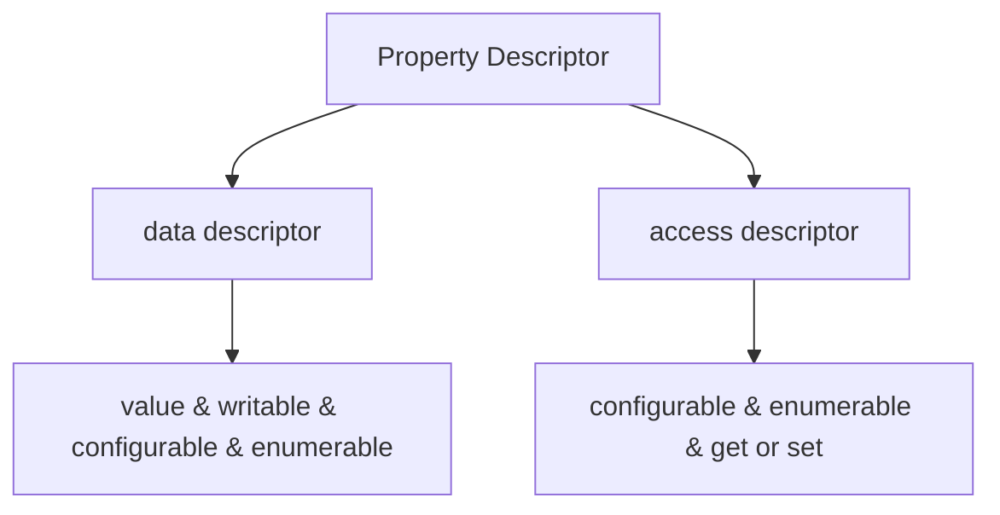
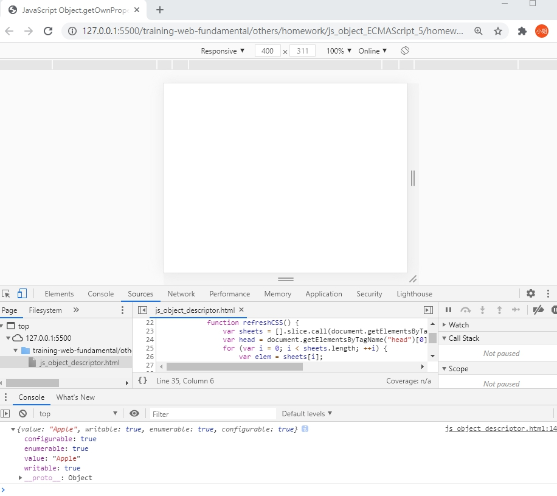
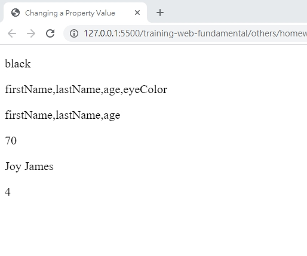
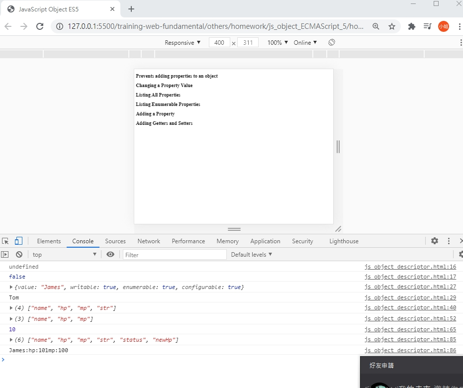

# JavaScript ES5 Object Methods

## 學習參考來源

[w3schools-JavaScript ES5 Object Methods](https://www.w3schools.com/js/js_object_es5.asp)

[你懂 JavaScript 嗎？#17 物件（Object）](https://ithelp.ithome.com.tw/articles/10204736)

[你懂 JavaScript 嗎？#18 （簡易版）物件導向概念](https://ithelp.ithome.com.tw/articles/10204974)

## 學習筆記

### 屬性描述器（Property Descriptor）

設定這些屬性特徵的函式稱為**屬性描述器**。

屬性描述器可用來檢視屬性的**特徵(屬性的設定)**，屬性特徵舉例如下:

值(value)、可否寫入（writable）、可否配置（configurable）、可否列舉（enumerable）、get、set

特徵|true|false
---|---|---|
writable|value可以被寫入|value不可以被寫入
configurable|1.可以刪除property;|1.不可以刪除property;
^|2.特徵值可以被修改|2.特徵值不可以被修改
enumerable|特徵可以被列舉|特徵不可被列舉

***當configurable為false時，writable仍可由true改為false，但不可由false改為true***

屬性描述器可分為:

**資料描述器（data descriptor):**
定義一個屬性時，此屬性不含取值器(Getter)或設值器(Setter)。

**存取器描述器（access descriptor):**
存取器描述器是指當定義一個屬性時，若此屬性擁有取值器或設值器，這個定義就會成為存取器描述器。

***此時屬性的 value 和特徵 writable 都會被忽略，而只需考慮 set、get、configurable 和 enumerable。***



### 取得屬性特徵

使用:`getOwnPropertyDescriptor(object, 'propertyName')`

```javascript
const obj={
    name:'Apple',
}
Object.getOwnPropertyDescriptor(obj,'name'); /*{value: "Apple", writable: true, enumerable: true, configurable: true}*/
```



### 定義物件的屬性與特徵(defineProperty)

使用:

`Object.defineProperty(object,property,descriptor)`

目的:

1. 新增屬性，通常是為了修改預設特徵的值。

2. 若特徵是 `configurable:true` 的話，則可用來刪除屬性；屬性的特徵值可以被更新。

```javascript
const obj={
    name:'Apple',
};
Object.defineProrerty(obj,'name',{
  value: 'Banana',
  writable: true,
  configurable: true,//可配置-->可以修改屬性特徵
  enumerable: true,
});
console.log(obj.name);//Banana
```

### 回傳物件的屬性有兩種方式:`Object.keys` vs `Object.getOwnPropertyNames`

1. `Object.keys(object)`:以陣列形式回傳所有可列舉（enumerable:true）的屬性。

2. `Object.getOwnPropertyNames(object)`:以陣列形式回傳所有屬性，不管是否可被列舉。

### `Object.getPrototypeOf(object)`

### 避免擴充（Prevent Extensions）

目的:為了防止物件被加入新屬性

使用:`Object.preventExtensions(object)`

```javascript
const obj ={
  name:Jame,
};
Object.preventExtensions(obj);
obj.hello='world';
obj.hello//undefined
```

***在嚴格模式下，加入新屬性會丟出 TypeError。***

#### 測試物件是否為可擴充(Extensible)

使用:`Object.isExtensible(object)`

### 密封（Seal）

作用:
物件不可再新增屬性(property)、重新配置特徵值(descriptor)或刪除屬性，但可能可以修改屬性值(需依據writable:ture or not)。

使用:`Object.seal(object)`

造成:

- 1.`Object.preventExtensions(object)`

- 2.`configurable: false`

```javascript
const obj={
  name:'Jack';
};
Object.seal(obj);
obj.hello='World';//無法新增屬性
obj.hello;//undefined

delete obj.name;//無法刪除屬性,false

Object.definePropoty(obj,'name',{ //無法重新配置屬性特徵
  value:3.14,
  writable:false,
  configurable:true,
  enumerable:true
});//typeError
```

#### 測試物件是否為密封狀態

使用:`Object.isSealed(object)`

### 凍結（Freeze）

使用:`Object.freeze(obj)`

造成:

- 1.`Object.seal`:屬性不可新增、屬性不可刪除、特徵值不可被變更

- 2.`writable:false`:屬性值不可變更

#### 測試物件是否為凍結狀態

`Object.isFrozen(object)`

### 取值器（Getter)與設值器（Setter）

`[[Get]]` :取得屬性值。

`[[Put]]` :

若屬性不存在，新增屬性並設值。

若屬性存在，此屬性是存取器描述器的`Setter`或`Getter`，則呼叫`Setter`。

若此屬性是可寫入的，就將值設定給這個屬性。

複寫以上兩種行為，則可透過Getter與Setter。

```javascript
const obj ={};
Object.definePropertype(obj,'name',{
  configurable:ture,
  enumerable:ture,
  get: function name(){
    return this._name_;
  },
  set: function name(value){
    this._name_='Hi,I am $(value)';
  },
});
obj.name='Jack';
obj.name//'Hi,I am Jack'
```

## 實作

- 呈現如下





- [作品原始碼](./homework/js_Property_Practice.html)
  
- [作品原始碼2](./homework/js_ES5_Practice.html)
