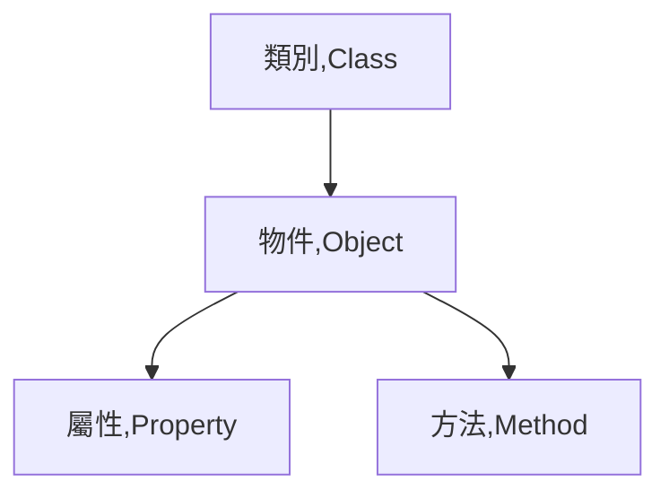
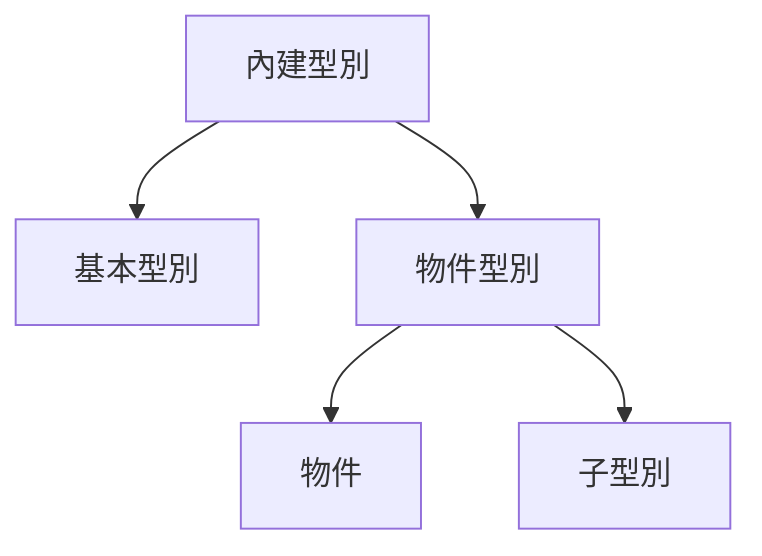

# avaScript Object Constructors

## 學習參考來源

[w3schools-JavaScript Object Constructors](https://www.w3schools.com/js/js_object_constructors.asp)

[你懂 JavaScript 嗎？#17 物件（Object）](https://ithelp.ithome.com.tw/articles/10204736)

## 學習筆記

### [建立物件](../../../practices/15_js_basic_object/README.md)

### 物件導向的基本元素



- 類別:ex.Blueprints，可用來確保多個物件是否為同一型別(Type)
- 物件:ex.實際的個體
- 屬性:ex.物件的外觀
- 方法:ex.物件共通、本身就會的
- 事件(Event):ex.被動觸發的動作(不一定每個物件都會觸發)


*物件( Object )就是類別（Class）的實體（Instance），建構子（Constructor）則是達成實體的特殊方法。*

### 檢測型別

使用`typeof`檢測型別為基本型別還是物件型別

```javascript
typeof {name:"Jack"} //object
```

使用`Object.prototype.toString.call`來檢視屬於哪個子型別

```javascript
Object.prototype.toString.call({name:"Jack"})//[object Object]
```

### 增加、更變建構式的屬性/方法

1.為物件增加屬性

```javascript
function Person(first,last,age,color){ //建立一個建構物件的函式
    this.firstName=first;
    this.lastName=last;
    this.age=age;
    this.eyeColor=color;
}
var myFather = new Person("John","Doe",50,"blue");
myFather.nationality="English";  //為myFather變數(內裝的物件)增加新屬性
document.getElementById.innerHTML=
"My father is "+myFather.nationality+"." ; //My father is English.
```

2.為物件增加方法

```javascript
function Person(first,last,age,color){ 
    this.firstName=first;
    this.lastName=last;
    this.age=age;
    this.eyeColor=color;
}
var myFather = new Person("John","Doe",50,"blue");
myFather.name=function(){   //為myFather變數(內裝的物件)增加方法
    return this.firstName+" "+this.lastName;
}
document.getElementById.innerHTML=
"My father is "+myFather.name+"."; //My father is John Doe.
```

3.不可為建構式增加屬性或方法

錯誤範例如下:

```javascript
function Person(first,last,age,color){ 
    this.firstName=first;
    this.lastName=last;
    this.age=age;
    this.eyeColor=color;
}
Person.nationality="English";
var myFather = new Person("John","Doe",50,"blue");
document.getElementById.innerHTML=
"My father is "+myFather.nationality+"."; /*My father is undefined。(但寫成"My father is "+Person.nationality+"."是可以的)*/
```

***結論:要添加建構式的屬性、方法，一定要把他放在建構式的function裡面；但你可以在宣告物件後，為物件新增屬性和方法。***

4.修改建構式中屬性的值

```javascript
function Person(firstName,lastName,age,color){ 
    this.firstName=firstName;
    this.lastName=lastName;
    this.age=age;
    this.eyeColor=color;
    this.changeName=function(name){
        this.lastName=name;
    };
};
var myMother =new Person("Sally","Rally",48,"green");
myMother.changeName("Doe"); //方法需要被呼叫才會發生
document.getElementById.innerHTML=
"My mother's last name is  "+myMother.lastName+"." ;//My mother's last name is Doe.
```

***結論:參數的值是可以(透過方法)被替換的***

## 內建物件（Built-in Objects）

使用內建函式所建立的物件，這些物件都屬於物件子型別的一種。

### 子型別

物件所有的子型別:String、Number、Boolean、Object、Function、
Array、Date、RegExp、Error

### 用途

給予開發者取得屬性或方法的使用(原生功能)。

### 使用`instanceof`來檢查建構式建立的物件的子型別(如string...等)是由哪個建構式建立

```javascript
const str = 'Hello World!';
str instanceof String; // false,str不是來自於String建構式
```

```javascript
const strObj = new String('Hello World!');
strObj instanceof String  //true,strObj來自於String建構式
```

- null 和 undefined 只有基本資料型別，沒有物件包裹形式，意即沒有對應的物件子型別，所以無法使用 new 來產生。

- Date、RegExp、Error 沒有基本資料型別的形式，所以只能使用物件子型別 new 來產生。

### 內建建構子(Built-in Constructors)

String(), Number(), Boolean(), Array(), and RegExp()無需使用，因以上型別皆是物件型別(object)(使用typeof檢測均為object)。

*Math()為global object，故無法使用關鍵字`new`*

### 使用符號來取代文字表達建立物件

符號|型別
---|---|
`{}`|new Object
`""`|new String
`數字`|new Number()
`true/false`|new Boolean
`[]`|new Array
`/()/`|new RegExp
`(){}`|new Function

## 延伸筆記

### 內建型別（Built-in Types）

分為基本型別（primitives）(如:number、string、boolean、null、undefined、symbol)和物件型別（object）(如:object、array、function、date)

物件型別（object）就是物件與其子型別（subtype）



## 實作

- 呈現如下


- [作品原始碼1](/training-web-fundamental/others/homework/js_object_constructors/homework/js_Object_construction_practice.html)

- [作品原始碼2](/training-web-fundamental/others/homework/js_object_constructors/homework/js_Typeof_object.html)
