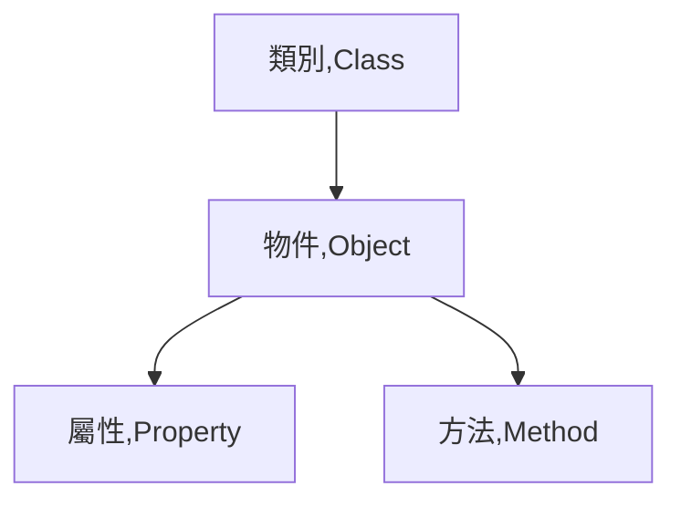

# avaScript Object Constructors

## 學習參考來源

[w3schools-JavaScript Object Constructors](https://www.w3schools.com/js/js_object_constructors.asp)

## 學習筆記

### [建立物件](../../../practices/15_js_basic_object/README.md)

### 物件導向的基本元素

- 類別:ex.Blueprints，用來確保多個物件是否為同一型別(Type)
- 物件:ex.實際的個體
- 屬性:ex.物件的外觀
- 方法:ex.物件共通、本身就會的
- 事件(Event):ex.被動觸發的動作(不一定每個物件都會觸發)

*物件( Object )就是類別（Class）的實體（Instance），建構子（Constructor）則是達成實體的特殊方法。*

### 檢測型別

使用`typeof`
## 實作

- 呈現如下

- [作品原始碼]()
