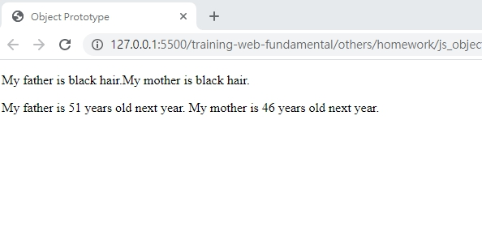

# JavaScript Object Prototypes

## 學習參考來源

[w3schools-JavaScript Object Prototypes](https://www.w3schools.com/js/js_object_prototypes.asp)

[你懂 JavaScript 嗎？#18 （簡易版）物件導向概念](https://ithelp.ithome.com.tw/articles/10204974)

## 學習筆記

### 原型繼承(Prototype Inheritance)

所有物件都從原型繼承屬性和方法，子類別繼承了父類別的特性。

```javascript
class Person{
    career = null;//class的屬性與值
    Person(job){  //class的方法
        career=job;
    }
    sayHi(){
        pring("Hello,I am a/n",career);
    }
}
class Coolperson inherits Person { /*子類別Coolperson繼承了父類別Person的方法sayHi()*/
    sayHi(){
        inherited:sayHi();
        pring("I love my job!");
    }
    eat(food){
        pring("I am eating ...",food);
    }
}
```

### 使用prototype來新增建構式的屬性

```javascript
function Person(first, last, age, eye){
    this.firstName = first;
    this.lastName = last;
    this.age = age;
    this.eyeColor = eye;
};
Person.prototype.national="English";
var myFather =new Person("John", "Doe", 50, "blue");
document.getElementById("demo").innerHTML =
"The nationality of my father is "+myFather.national+"." /*The nationality of my father is English.*/
```

### 使用prototype來新增建構式的方法

建構式名稱.prototype.新增的屬性/方法名

```javascript
function Person(first, last, age, eye){
    this.firstName = first;
    this.lastName = last;
    this.age = age;
    this.eyeColor = eye;
};
Person.prototype.name=function(){
    return this.firstName+" "+this.lastName; //方法需要回傳值
};
var myFather = new Person("John", "Doe", 50, "blue");
document.getElementById("demo").innerHTML =
"My father is " + myFather.name()+".";/*My father is John Doe.*/
```

## 實作

- 呈現如下



- [作品原始碼](../js_object_prototype/homework/js_Object_prototype_practice.html)