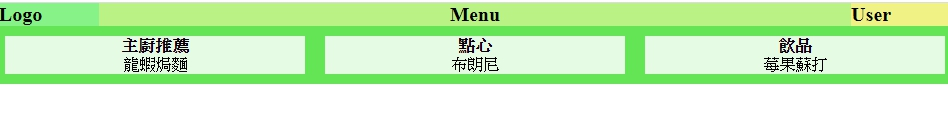

# 網頁前端工程入門：CSS3 Flexbox 排版基礎教學

目的:使容器中的項目並排(切欄)顯示

## 學習參考來源

[網頁前端工程入門：CSS3 Flexbox 排版基礎教學 By 彭彭](https://www.youtube.com/watch?v=CB-s9s1-r7Q&list=PL-g0fdC5RMbpqZ0bmvJTgVTS4tS3txRVp&index=7)

## 學習筆記

### 何為CSS3 Flexbox

Flexbox是一個CSS3中的排版工具，可取代`display:inline-block`的作用。

### CSS3 Flexbox排版

透過使用`flex`設定達到以前先設定`margin-left/right:auto`，再設定`box:width`&`margin`&`padding`像素，最後再設定`display:inline-block`&`vertical-align:top`的方法，有效精簡程式。
具體方法為以下:

方法:

先處理***並排(切欄)*** :容器設定顯示模式`display:flex`；項目設`flex:none`並給寬度

再處理***水平對齊*** :容器設定`justify-content`

最後處理***垂直對齊*** :容器設定`align-items:stretch`

```html
<!DOCTYPE html>
    <html>
    <head>
        <meta charset="utf-8"/>
        <title>Lesson 7</title>
        <link href="style.css" rel="stylesheet" type="text/css" media="all"/>
    </head>
    <body >
        <nav>
        <div class="lego">Logo</div>
        <div class="menu">Menu</div>
        <div class="user">User</div>
        </nav>
        <main>       <!--容器裝三個項目(<div>)-->
        <div class="item">1<br/>happy</div>
        <div class="item">2</div>
        <div class="item">3</div>
        </main>
    </body>
    </html>
```

```javascript
main{
    diaplay:flex;/*容器內設定顯示模式是flex*/
    justify-content:center; /*水平對齊 (flex-start靠左對齊)(flex-end靠右對齊)*/
    align-items:stretch;/*(預設值stretch=>其他div區塊會自動延展)(flex-start垂直對齊靠上)(flex-end垂直對齊靠下)*/
    background-color:#cccccc;
}
main>.item{
    flex:none;
    width:300px;margin:10px;/*設定flexg屬性為none代表此項目無法自動縮放完全按我們給的設定width:300px;margin:10px顯示=>並排*/
    background-color:#cccccc;
}

nav{
    display:flex;
}

nav>.logo{
    flex:none;width:100px;/*沒有彈性，固定尺寸*/
    background-color:#ffcccc;
}
nav>.menu{
    flex:auto; /*盡量把容器張滿(會依視窗大小自動調整張滿，有彈性)*/
    background-color:#ccccff;
}
nav>.user{
    flex:none;width:100px;
    background-color:#ccffcc;
}
```

## 實作

- 呈現如下



- [作品原始碼](./homework/training7.html)
