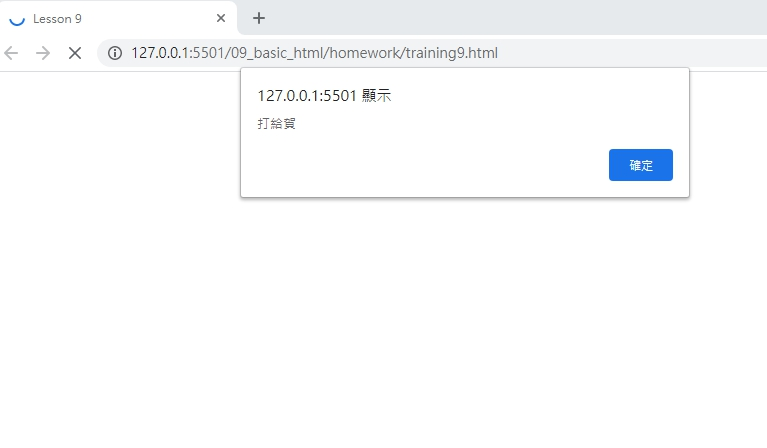

# 網頁前端工程入門：Javascript 簡介 By 彭彭

## 學習參考來源

[網頁前端工程入門：Javascript 簡介 By 彭彭](https://www.youtube.com/watch?v=LI4ADR4JKyA&list=PL-g0fdC5RMbpqZ0bmvJTgVTS4tS3txRVp&index=9)

## 學習筆記

### 何為Javascript

JavaScript 是一個成熟的動態程式語言，應用於 HTML 文件（document）上時，就可以為網頁提供動態的互動功能。

為一進階的、***直譯***的程式語言。基於原型並支援物件導向，並具有函數式程式設計的程式語言。

其為弱型別，變數可被隱式轉換為另一個類型。

### Javascript基礎

`alert`使用`()`來框住要呼叫的命令，字串要用雙隱號`""`包裹，使用如下

```html
<head>
    <meta charset="utf-8"/>
    <title>Lesson 9</title>
    <script type="text/javascript"> /*寫入屬性type"text/javascript"*/

        alert("Hello World");      /*一個`;`代表一個命令*/
        alert("大家好")
    </script>
</head>
```

## 實作

- 呈現如下



- [作品原始碼](./homework/training9.html)
