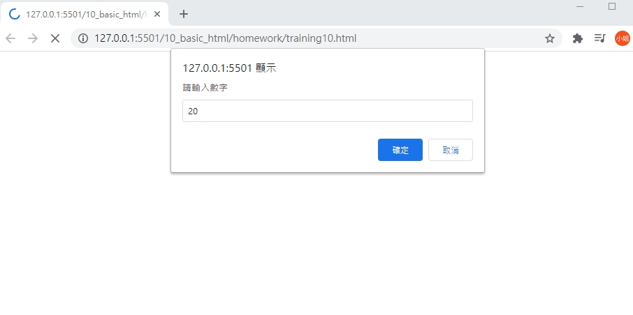
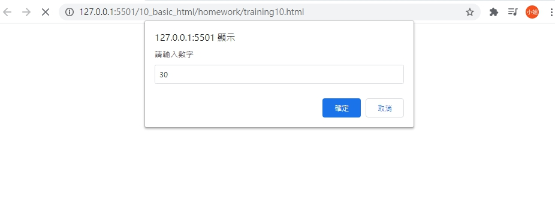
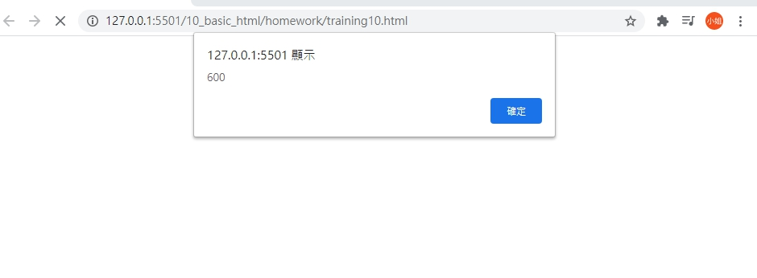

# 網頁前端工程入門：Javascript 變數與運算子 By 彭彭

變數、運算子、資料概念基礎。

## 學習參考來源

[網頁前端工程入門：Javascript 變數與運算子 By 彭彭](https://www.youtube.com/watch?v=pVXPcl2jFvw&list=PL-g0fdC5RMbpqZ0bmvJTgVTS4tS3txRVp&index=10)

## 學習筆記

### 變數與運算子

資料:數字、字串`string`(需用雙隱號包裹)、布林值`ture`&`false`、物件。

變數:可將資料存放進來，像一個儲存庫。一個變數只能裝一個資料。

[運算子](/pratical-js-operators/README.md):單元運算、比較運算子

使用者輸入:`prompt`(提示語,預設值)-->程式運算-->輸出`alert`(資料)

## 實作

- 呈現如下

- [作品原始碼](./homework/training10.html)
