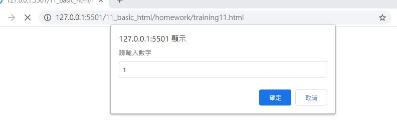
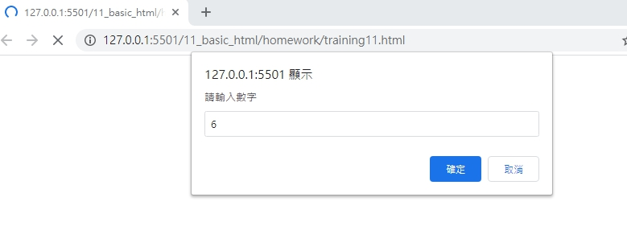
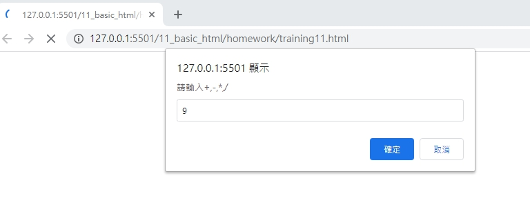
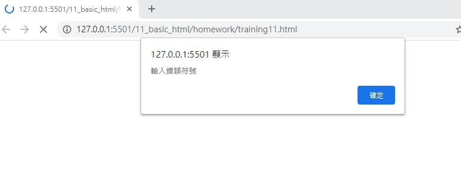

# 網頁前端工程入門：Javascript 流程控制 - 判斷式 By 彭彭

## 學習參考來源

[網頁前端工程入門：Javascript 流程控制 - 判斷式 By 彭彭](https://www.youtube.com/watch?v=LIgMGq0YRPE&list=PL-g0fdC5RMbpqZ0bmvJTgVTS4tS3txRVp&index=11)

## 學習筆記

### 流程控制-判斷式

1.if(判斷式:結果為布林值){

如判斷式的結果為true則執行這個{}內的function；如為否，則跳過這個{}內的function

}

2.if(判斷式){

如判斷式的結果為true則執行這個{}內的function；如為否，則跳過這個{}內的function執行else後面的function

}

else{

}

3.if(判斷式){

先做第一次判斷，如為true，則執行此塊程式碼

}

else if(判斷式二){

如第一次判斷為false，則做第二次判斷二，如為true，則執行此塊程式碼

}

else{

如第二次判斷仍為false，則執行此塊程式碼
}

```javascript
var n1=prompt("請輸入數字","");
var n2=prompt("請輸入數字","");
var op=prompt("請輸入運算:+,-,*,/","");
n1=Number(n1);n2=Number(n2) //字串轉數字的轉換
var result;
if(op=="+"){
    result=n1+n2;
}
else if(op == "-"){
    result=n1-n2;
}
else if(op=="*"){
    result=n1*n2;
}
else if(op =="/"){
result=n1/n2;
}
else{
    result="無效的輸入符號";
}
alert(result);
```

## 實作

- 呈現如下






- [作品原始碼](./homework/training11.html)
