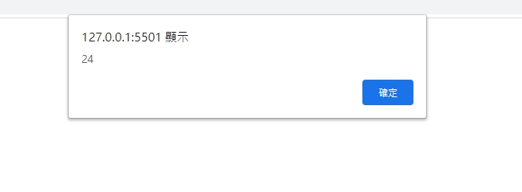

# 網頁前端工程入門：Javascript 流程控制 - 迴圈 By 彭彭

## 學習參考來源

[網頁前端工程入門：Javascript 流程控制 - 迴圈 By 彭彭](https://www.youtube.com/watch?v=uvLMIXuuc-8&list=PL-g0fdC5RMbpqZ0bmvJTgVTS4tS3txRVp&index=12)

## 學習筆記

### 流程控制-迴圈

1.while(判斷){

若判斷結果為正確的(true)，執行{}中的程式碼。
程式碼執行完畢，回到上方while的位置，做第二次判斷，直到判斷結果為錯誤的(false)，才跳離整個迴圈結構

}

例一

```javascript
while(true){
alert("hello,world");  //無窮迴圈
}
```

例二

```javascript
var n=1; sum=0;
while(n<=5){
sum=sum+n; /*sum+=n；1st sum=1 n=2 ;2nd sum=3 n=3;3rd sum=6  n=4;4th sum=10 n=5;5th sum=15 n=6*/
n++; //1+2+3+4+5=15
}
alert(sum);
```

2.for(初始區塊;判斷;迴圈區塊){

判斷概念同while迴圈。}

```javascript
var sum=0;
for(var i=1;i<=100;i++){
    sum=sum+i;
}
alert(sum);
```

### 搭配使用`break;`強制跳出迴圈;`continue`強制進行下一次的迴圈

例一

```javascript
var n=0;
while(n<=100){
if(n == 50){
    break;
}
n++; //50th n=50 51th=>true=>break =>n=50
}
alert(n);
```

例二

```javascript
var x=0;
for(var i=0;i<=100;i++){
if(i%4 == 0 ){  //i能被4整除(沒有餘數)
    continue;//強制直接重頭進行
}
x++;
}
alert(x);/*100中能被4整除的數字有25個，當整除時continue會強制重頭進行，故x不進行+1；每進行一次x就+1，進行100次其中25次沒有運行到最後，故x=75*/
```

## 實作

- 呈現如下



- [作品原始碼](./homework/training12.html)
