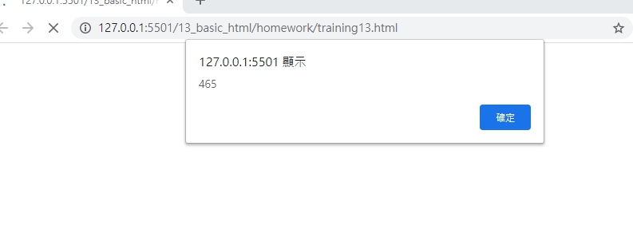
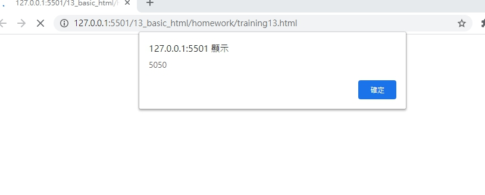
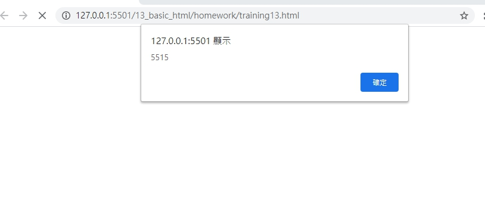

# 網頁前端工程入門：Javascript 函式 - 基礎使用 By 彭彭

## 學習參考來源

[網頁前端工程入門：Javascript 函式 - 基礎使用 By 彭彭](https://www.youtube.com/watch?v=A5s8BbE27hk&list=PL-g0fdC5RMbpqZ0bmvJTgVTS4tS3txRVp&index=14)

### 學習筆記

### 何為函式（Function）

函式用來將程式組織為一個小的、獨立的運行單元，一個函式可以接受資料，並運行其中的算法，最後將結果傳回。

只使用一個函式（Function），此函式即稱為 main 主函式，若某些程式碼經常使用，可以抽出成為新函式以便重覆呼叫。

### 函式的組成

函式的組成主要包括四個部份：**返回值**、**函式名稱**、**參數列**與**函式主體**。前三者稱為函式宣告或函式原型（Function prototype）。

### 常見的函式

#### 內建函式:如`alert()`

#### 設計函式

步驟:

1.設計一個函式:
function 函式的名稱(參數的名稱){ 大括號內裝函式本體  
    alert(參數的名稱);
}

2.使用參數給函式彈性:
參數使用`,`隔開

3.呼叫函式:

函式的名稱(傳入函式的參數資料);

***數字不可以拿來呼叫***

4.回傳值:看函式的結果要看回傳值

```javascript
function add(n1,n2){
    alert(n1+n2);
    return n1+n2;//函式結束，函式回傳到呼叫的位置
}
var result= add(3,4)*add(10,20);
alert(result);  //呼叫函式result
```

運用:

(1加到50)乘上(1加到100)

```javascript
function getsum(max){
    var sum=0;
    var n=1;
    while(n<=max){
    sum+=n;
    n++;
    }
    alert(sum);
    return sum;
    }
var result=getsum(50)*getsum(100);
alert(result);
```

## 實作

- 呈現如下





- [作品原始碼](./homework/training13.html)
