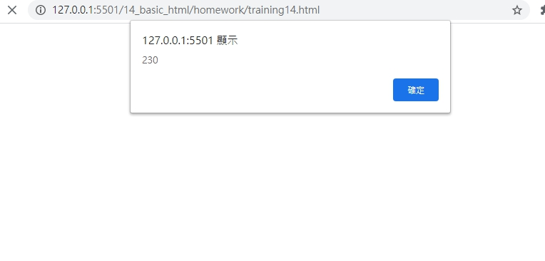
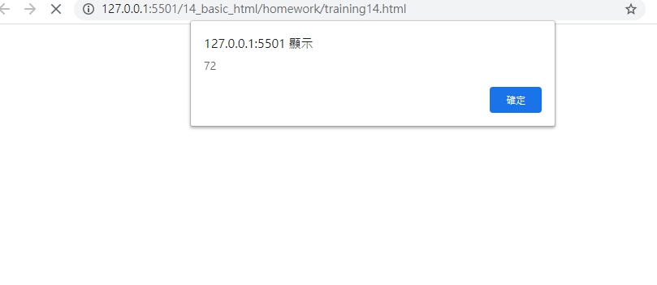

# 網頁前端工程入門：Javascript 函式 - 延伸觀念 By 彭彭

宣告函式，使用變數並留意變數存在的位置。

## 學習參考來源

[網頁前端工程入門：Javascript 函式 - 延伸觀念 By 彭彭](https://www.youtube.com/watch?v=qmrVxIj97g4&list=PL-g0fdC5RMbpqZ0bmvJTgVTS4tS3txRVp&index=15)

## 學習筆記

### 函式的變形

函式為一種資料，可放入變數中:

```javascript
function add(n1,n2){
    alert(n1+n2);
}
```

也可以寫成

```javascript
var add=function(n1,n2){
    alert(n1+n2);
}
```

關於呼叫

```javascript
var add=function(n1,n2){
    alert(n1+n2);
}
add(31,15);   //呼叫函式add
var test=add; //只代表函式本身
test(10,20);
```

### 宣告變數與資料之關聯

- 注意宣告的變數所代表的資料，來判斷如何使用變數:
  
  如為數值-只能做四則運算 **數字不可拿來呼叫**
  
  如為字串-可做字串的連接 **字串不會進行乘除，只能串接**
  
  如為函式-可進行呼叫 **不會對函式做加法**

以下為錯誤使用舉例

```javascript
var x=3;
var x=6;  //錯誤，重複宣告x

var x=3;
function test(){
    var y=5;
    alert(y);
}
test();
```

- 注意呼叫變數，變數在的位置

  全域空間:函式外部的空間(大家共用的空間)；全域變數:在函式外部的變數(大家共用的變數)

  區域空間:函式內的空間(函式私有的空間)；區域變數:在函式內的變數(只供這個函數使用的變數)

***規則:外部的程式碼不能使用內部的變數***

以下為錯誤的舉例

```javascript
var x=3;
function test () {
    var y=5;
    var x=6;
    alert(x+y);
}
alert(x+y);  //外部的程式碼alert()，使用內部的變數y
```

## 實作

- 呈現如下




- [作品原始碼](./homework/training14.html)
