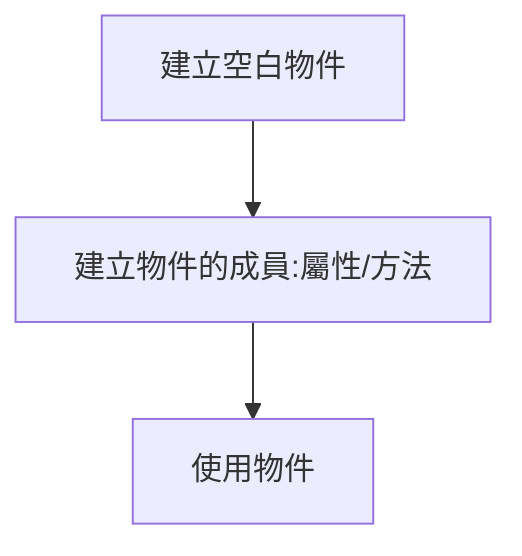
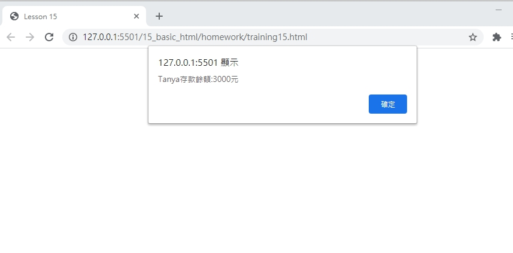

# 網頁前端工程入門：Javascript 物件 - 基礎使用 By 彭彭

## 學習參考來源

[網頁前端工程入門：Javascript 物件 - 基礎使用 By 彭彭](https://www.youtube.com/watch?v=Vwg7BaPBK-Y&list=PL-g0fdC5RMbpqZ0bmvJTgVTS4tS3txRVp&index=16)

## 學習筆記

### 何為物件

物件（object）是一個記憶體位址，其中擁有值，這個位址可能有標識符指向此處。物件可以是一個變數，一個資料結構，或是一個函式。

物件具有唯一的識別碼，物件包括**屬性（Properties）**和**方法（Methods）**，屬性就是需要記憶的資訊，方法就是物件能夠提供的服務。

### 物件基礎設計



```javascript
var player=new Object(); //建立空白物件
    player.name="Tom"; //建立物件屬性
    player.hp=100;
    player.fight=function(){ //建立物件方法
        this.hp=this.hp-2;
    };
    player.rest=function(){
        this.hp++;
    };
    player.report=function(){
        alert(this.name+":"+this.hp);
    };
    player.fight();/*使用物件;player.hp=98*/
    player.rest();//99
    player.report();//Tom:99
```

## 實作

- 呈現如下



- [作品原始碼](./homework/training15.html)
