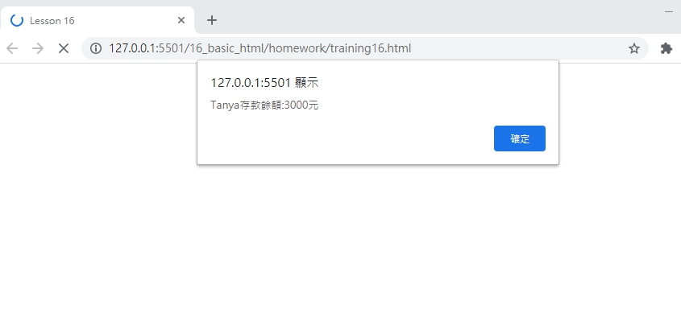
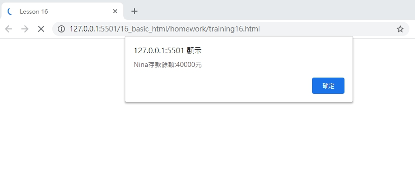
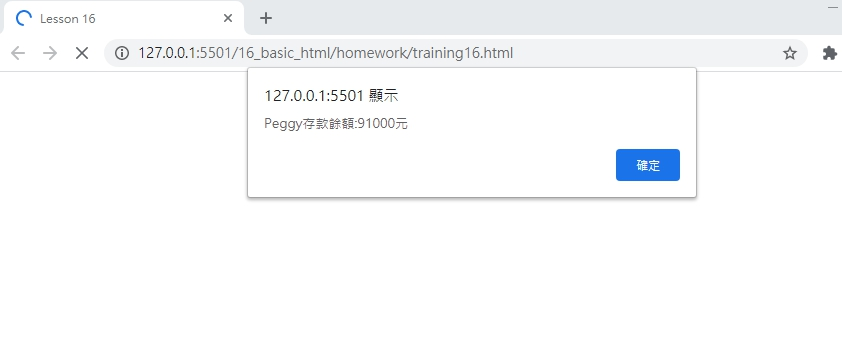

# 網頁前端工程入門：Javascript 物件 - 建構式 By 彭彭

目的:取代重複設計物件的麻煩，讓畫面較簡潔且輕鬆。

## 學習參考來源

[網頁前端工程入門：Javascript 物件 - 建構式 By 彭彭](https://www.youtube.com/watch?v=xSu7TbPPy34&list=PL-g0fdC5RMbpqZ0bmvJTgVTS4tS3txRVp&index=17)

## 學習筆記

### 建構函式(建構式/建構子)

```javascript
function Player(name,hp){ //建構式，函式名稱首字大寫
    this.name=name; /*this 代表新建構的空白物件它自己，為一個關鍵詞(keyword)，本身沒有值，創造新的空白物件後，值就是這個物件*/
    this.hp=hp;
    this.flight=function(){
        this.hp=this.hp-2;
    };
    this.rest=function(){
        this.hp++;
    };
    this.report=function(){
        alert(this.name+":"+this.hp);
    };
};
var player=new Player("Tom",100);   /*呼叫、使用時前面加new*/
player.flight();
player.flight();
player.report();//tom:96
var player2=new Player("Kim",90);
player2.flight();
player2.rest();
player2.report();//Kim:89
```

## 實作

- 呈現如下





- [作品原始碼](./homework/training16.html)