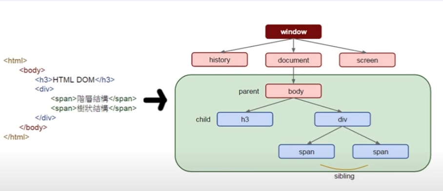
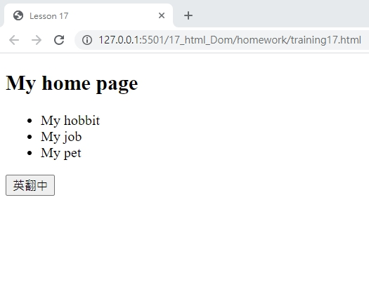
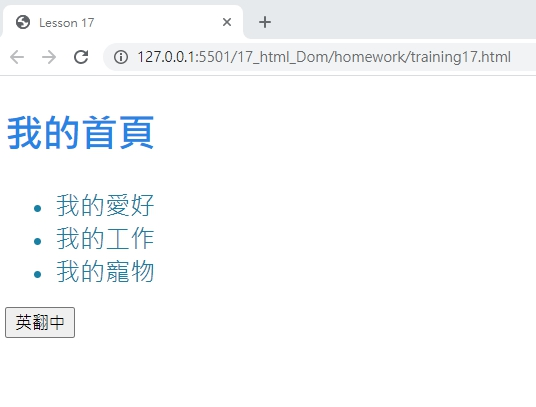

# 網頁前端工程入門：HTML DOM - 基本觀念 By 彭彭

## 學習參考來源

[網頁前端工程入門：HTML DOM - 基本觀念 By 彭彭](https://www.youtube.com/watch?v=iZ3LfVujGCM&list=PL-g0fdC5RMbpqZ0bmvJTgVTS4tS3txRVp&index=18)

## 學習筆記

### HTML 動態的物件結構

樹狀結構如下圖:



window:全域物件

history:歷史(區域)物件

document:文件(區域)物件

screen:螢幕(區域)物件

body、h3、div、span:標籤物件

***物件之間有繼承（Inheritance）關係，產生截點:parent、child、sibling***

### 基本架構

透過js取得螢幕解析度

```html
<!DOCTYPE html>
<html>
    <head>
        <meta charset="utf-8"/>
        <title>HTML DOM</title>
        <script type="text/javascript">
        alert(window.screen.width+"x"+window.screen.height);//全域物件window裡，screen子物件下的屬性width&height
        </script>
    </head>
    <body>

    </body>
</html>
```

### 透過function操控網頁畫面

取得body標籤後修改內部設定，配合使用事件處理(使html反應使用者的動作)呼叫函式。

```html
<!DOCTYPE html>
<html>
    <head>
        <meta charset="utf-8"/>
        <title>HTML DOM</title>
        <script type="text/javascript">
        function change(){
            window.document.body.innerHTML="Hello World";//變動的目標<body>標籤，函式會將<body>的內容全部替換為字串"Hello World"
        }
        </script>
    </head>
    <body>
        <button onclick="change();">Chang</button><!--做一個事件的處理，click屬性，代表點擊後會做等號後的處理，此處裡為一個函式的呼叫-->

    </body>
</html>
```

### 常見的使用

在區塊標籤呼叫函式，透過事件處理，對畫面做部分更新。

做法:

- 1.給標籤上屬性id，並命名屬性名稱

- 2.在函式中使用原生方法`getElementById()`，將元素/參數(欲取得的名稱)放入

- 3.取得標籤，修改標籤內的內容(`innerHTML`)及css(使用`style`屬性)

```html
<!DOCTYPE html>
<html>
    <head>
        <meta charset="utf-8"/>
        <title>HTML DOM</title>
        <script type="text/javascript">
        function change(){
            var spanObj=window.docment.getElementById("emotion");//將物件存放入區域變數裡;window可省略，等同於docment.getElementById("emotion");
            spanObj.innerHTML="bad";//spanObj標籤物件，做內文修改
            spanObj.style.color="red";
            spanObj.style.fontWeight="bold";//將font-weight轉換成fontWeight
            spanObj.style.display="none";//將內文藏起來，設置為none
        }
        </script>
    </head>
    <body>
        <div>
            Today is a <span id="emotion">good</span> day.Let's go to movie.<!--設置屬性&名稱-->
        </div>
        <button onclick="change();">Change</button><!--onclick要使用change()函式才能發揮功用-->
    </body>
</html>
```

## 實作

- 呈現如下





- [作品原始碼](./homework/training17.html)
