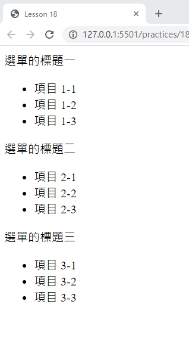
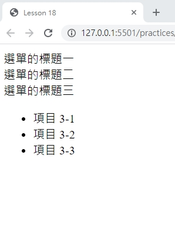

# 網頁前端工程入門：HTML DOM - 選單開合範例 By 彭彭

## 學習參考來源

[網頁前端工程入門：HTML DOM - 選單開合範例 By 彭彭](https://www.youtube.com/watch?v=SWhNYC6QYDc&list=PL-g0fdC5RMbpqZ0bmvJTgVTS4tS3txRVp&index=19)

## 學習筆記

### 做出選單收合

使用事件處理`onclick`，設置函式`toggle()`，並使用HTML DOM選用標籤，對標籤進行設置

```html
<!DOCTYPE html>
<html>
    <head>
        <meta charset="utf-8"/>
        <title>HTML DOM選單開合操作<title>
        <script type="text/javascript">
        function toggle(){ //設置切換的函式
            var menu=document.getElementById("menu");//使用HTML DOM取用Id為menu標籤
            menu.style.display="none";//做css設置顯示none
        }
        </script>
    </head>
    <body>
        <div onclick="toggle()">選單的標題1</div><!--使用事件處理-->
        <ul id="menu">
            <li>項目 1-1</li>
            <li>項目 1-2</li>
            <li>項目 1-3</li>
        </ul>
    </body>
</html>
```

### 做出選單開合

方法一:使用迴圈設計讓函式判斷開合

```html
<!DOCTYPE html>
<html>
    <head>
        <meta charset="utf-8"/>
        <title>HTML DOM選單開合操作<title>
        <script type="text/javascript">
        function toggle(){
            var menu=document.getElementById("menu");
            if (menu.style.display=="none"){ //如果顯示為none則回復原狀
                menu.style.display="block";
            }
            else{
                menu.style.display="none";//反之就顯示none
            }
        }
        </script>
    </head>
    <body>
        <div onclick="toggle()">選單的標題1</div>
        <ul id="menu">
            <li>項目 1-1</li>
            <li>項目 1-2</li>
            <li>項目 1-3</li>
        </ul>
    </body>
</html>
```

方法二:設置CSS標籤選擇器達到選單開合

```html
<!DOCTYPE html>
<html>
    <head>
        <meta charset="utf-8"/>
        <title>HTML DOM選單開合操作</title>
        <script type="text/javascript">
        function toggle(){
            var menu=document.getElementById("menu");
            menu.classList.toggle("hide");/*選取menu物件下的子物件classList裡的方法toggle()，切換class名稱*/
        }
        </script>
        <style type="text/css">/*使用標籤選擇器套用display:none*/
        .hide{display:none};
        </style>
    </head>
    <body>
        <div onclick="toggle()">選單的標題1</div>
        <ul id="menu">
            <li>項目 1-1</li>
            <li>項目 1-2</li>
            <li>項目 1-3</li>
        </ul>
    </body>
</html>
```

### 多個開合選單可以分別開合

加入參數讓函式能套用至多個標籤內部

```html
<!DOCTYPE html>
<html>
    <head>
        <meta charset="utf-8"/>
        <title>HTML DOM選單開合操作</title>
        <script type="text/javascript">
        function toggle(number){
            var menu=document.getElementById("menu-"+number);//number會被隱性轉換成string
            menu.classList.toggle("hide");
        }
        </script>
        <style type="text/css">
        .hide{display:none};
        </style>
    </head>
    <body>
        <div onclick="toggle(1)">選單的標題1</div><!--此處的參數可不從1開始且沒有順序，但必須與id設置的數字相同-->
        <ul id="menu-1">
            <li>項目 1-1</li>
            <li>項目 1-2</li>
            <li>項目 1-3</li>
        </ul>
        <div onclick="toggle(2)">選單的標題2</div>
        <ul id="menu-2">
            <li>項目 2-1</li>
            <li>項目 2-2</li>
            <li>項目 2-3</li>
        </ul>
        <div onclick="toggle(3)">選單的標題3</div>
        <ul id="menu-3">
            <li>項目 3-1</li>
            <li>項目 3-2</li>
            <li>項目 3-3</li>
        </ul>
    </body>
</html>

```

## 實作

- 呈現如下





- [作品原始碼](/practices/18_html_Dom_menu/homework/training18.html)
