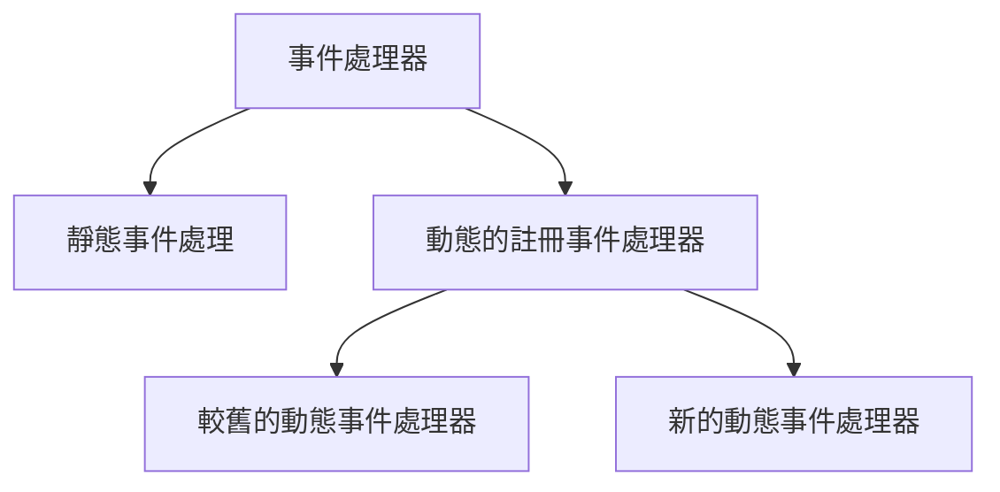
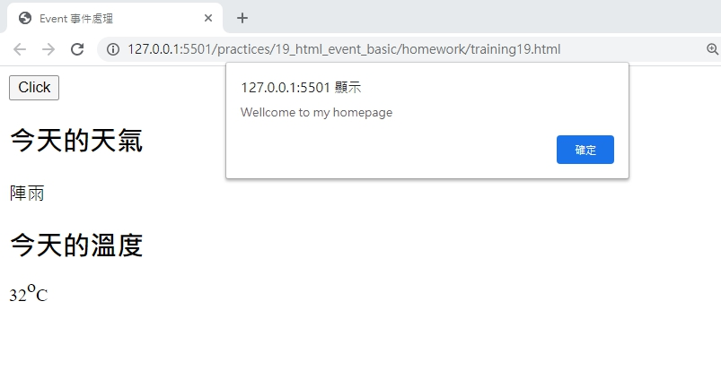
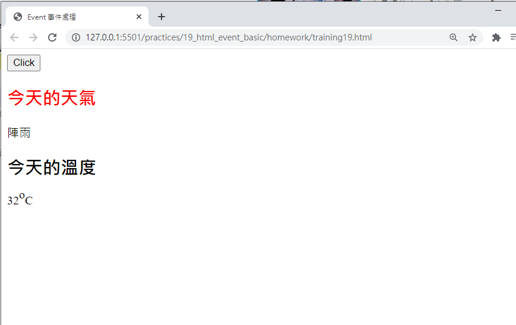

# 網頁前端工程入門：Javascript 事件處理 - 基本教學 By 彭彭

## 學習參考來源

[網頁前端工程入門：Javascript 事件處理 - 基本教學 By 彭彭](https://www.youtube.com/watch?v=BPdQ-C5jP74&list=PL-g0fdC5RMbpqZ0bmvJTgVTS4tS3txRVp&index=20)

## 學習筆記

### 什麼是JS事件處理(Event)

當使用者對畫面進行動作時，程式必須偵測到動作並做出反應。

### 事件處理器的分類



### 常見的事件

on|事件名稱|說明
---|---|---|
^|click|點擊
^|mouseover|鼠標移到標籤區塊上
^|mouseout|鼠標移開標籤區塊後
^|load|通常作用於body區塊，代表頁面載入時

***事件均使用於標籤區塊***

### 靜態的事件處理器(將事件處理器放在標籤上)

範例:創建一個按鈕產生警告視窗

```html
<!DOCTYPE html>
<html>
    <head>
        <meta charset="utf-8"/>
        <title>Event 事件處理</title>
        <script type="text/javascript">
        </script>
    </head>
    <body>
        <button onclick="alert('clicked');">Click</button><!--需留意屬性內如需要設置兩次引號，需交替使用(雙引號與單引號)，以免產生狀況-->
    </body>
</html>
```

範例:使用事件:`onmouseover`&`onmouseout`

```html
<!DOCTYPE html>
<html>
    <head>
        <meta charset="utf-8"/>
        <title>Event 事件處理</title>
        <script type="text/javascript">
        </script>
    </head>
    <body>
        <button onclick="alert('clicked');">Click</button>
        <span onmouseover="this.style.color='red';" onmouseout="this.style.color='black';">今天下雨</span><!--this代表標籤span物件；修改物件的css-->
    </body>
</html>
```

使用函式並加入參數設置，達到提升畫面的可讀性:

優點:

- 畫面簡潔

- 其餘標籤區塊均可套用

```html
<!DOCTYPE html>
<html>
    <head>
        <meta charset="utf-8"/>
        <title>Event 事件處理</title>
        <script type="text/javascript">
        function over(element){ //this 取得span標籤物件，再傳進element參數內
            element.style.color="red";
        };
        function out(element){
            element.style.color="black";
        };
        </script>
    </head>
    <body>
        <button onclick="alert('clicked');">Click</button>
        <span onmouseover="over(this)" onmouseout="out(this)">今天下雨</span>
    </body>
</html>
```

***備註:此處不使用判斷式原因在，使用判斷式的函式判斷時間點在每一次鼠標移過去，即進行一次判斷(顏色的改變取決於鼠標移過去的時間點)，與希望達到鼠標移開顏色恢復的功能不同***

### 動態事件處理

用JS的程式，動態的註冊事件處理器(取得標籤、設置事件並置於script標籤內部，再使用函式包裹)

先決條件:於`<body>`標籤設置`onload`事件，觸發執行函式

範例(舊):

```html
<!DOCTYPE html>
<html>
    <head>
        <meta charset="utf-8"/>
        <title>Event 事件處理</title>
        <script type="text/javascript">
        function init(){
            var btn=document.getElementById("btn");//取得button標籤設置在btn物件上
            btn.onclick=function(){//物件+on事件名稱=事件處理器(處理函式)
                alert("clicked")};
        }
        </script>
    </head>
    <body onload="init();"><!--將load事件註冊在body標籤上，偵測body標籤的內容完全載入成功，就會觸發load事件，並執行函式init()-->
        <button id="btn">Click</button>
    </body>
</html>
```

範例(新):

```html
<!DOCTYPE html>
<html>
    <head>
        <meta charset="utf-8"/>
        <title>Event 事件處理</title>
        <script type="text/javascript">
        function init(){
            var btn=document.getElementById("btn");
            var handler=function(){ //準備一個事件處理器(對應事件的函式)
                alert("clicked");
            }
            btn.addEventListener("click",handler);//事件的註冊(把標籤與事件&處理器做關聯);方法的參數(事件,事件處理器名稱)
        }
        </script>
    </head>
    <body onload="init();">
        <button id="btn">Click</button>
    </body>
</html>
```

!!!
    延伸問題-CSS寫法何時使用`:`，何時使用`=`
    判斷方式:
    符號|時機|位置|是否加引號|範例
    ---|---|---|---|---|
    `:`|使用CSS語法|在標籤內|不需|color:red
    `=`|在函式內使用CSS|在函式中|需要加引號|color="red"

## 實作

- 呈現如下





- [作品原始碼](./homework/training19.html)
