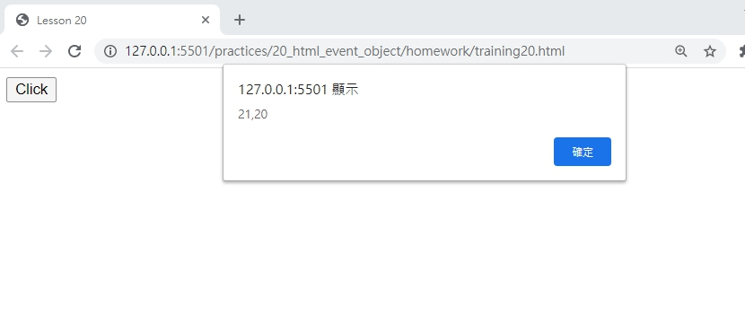
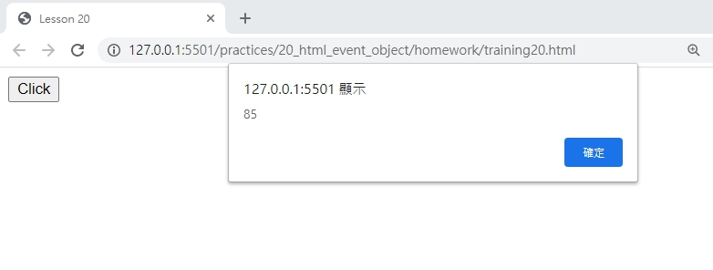

# 網頁前端工程入門：Javascript 事件處理 - Event Object 事件物件 By 彭彭

## 學習參考來源

[網頁前端工程入門：Javascript 事件處理 - Event Object 事件物件 By 彭彭](https://www.youtube.com/watch?v=6MIZmmV00cg&list=PL-g0fdC5RMbpqZ0bmvJTgVTS4tS3txRVp&index=21)

## 學習筆記

### 什麼是事件物件(Event Object)

事件物件是，當使用者觸發事件時，瀏覽器會主動生成一個物件(`eventObj`)，其中收集了與這個事件有關的資訊，然後呼叫已經註冊的事件處理器，放入這個事件物件當參數(headler(`eventObj`))，顯示設定的功能或字串。

### 事件物件的功用

透過事件物件，我們可取得使用者的資訊，如輸入的按鍵、鼠標點擊的位置等。

範例:

```html
<!DOCTYPE html>
<html>
    <head>
        <meta charset="utf-8"/>
        <title>事件物件</title>
        <script type="text/javascript">
        function init(){
            var btn=document.getElementById("btn");
            var handler=function(e){  //設定一個參數，給事件物件存放，使事件物件可以被呼叫
                alert(e.clientX+","+e.clientY);//事件物件底下的兩個屬性clientX與clientY(鼠標點擊的座標)
            };
            btn.addEventListener("click",handler);
            document.addEventListener("keydown",function(e){ /*keydown為鍵盤按下按鍵的事件;未宣告名稱的函示叫匿名函式，可用來直接當作事件處理器*/
                alert(e.keyCode);//keyCode為事件物件下的按鍵代號的屬性名稱
            });
        }
        </script>
    </head>
    <body onload="init();">
    <button id="btn">Click</button>
    </body>
</html>
```

***事件處理器的第一個參數就是事件物件，其名稱可以任意，且在不同的事件可以使用不同的參數代表事件物件***

## 實作

- 呈現如下





- [作品原始碼](./homework/training20.html)
