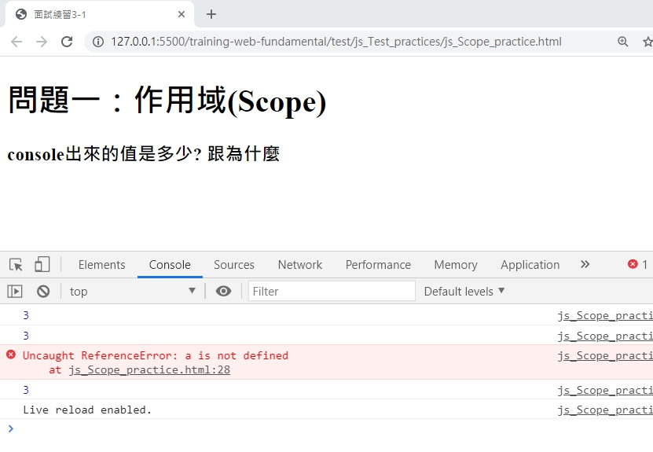
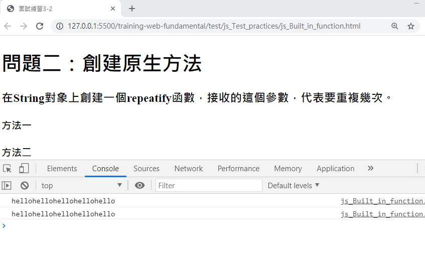
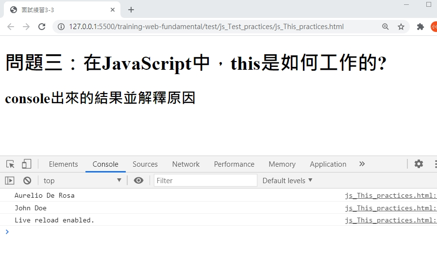

# 面試考古題

## 問題一:作用域(Scope)

console出來的值是多少? 跟為什麼

```javascript
(function() {
    var a = b = 3;
})();

console.log(b);
```

### 答案一呈現如下



- [解答過程原始碼](./homework/js_Scope_practice.html)

## 問題二：創建原生方法

在String對象上創建一個repeatify函數，接收的這個參數，代表要重複幾次。

```javascript
console.log('hello'.repeatify(5));
```

### 答案二呈現如下



- [解答過程原始碼](./homework/js_Built_in_function.html)

### 問題三：在JavaScript中，this是如何工作的

console出來的結果並解釋原因

```javascript
var fullname = 'John Doe';
var obj = {
   fullname: 'Colin Ihrig',
   prop: {
      fullname: 'Aurelio De Rosa',
      getFullname: function() {
         return this.fullname;
      }
   }
};
console.log(obj.prop.getFullname());

var test = obj.prop.getFullname;
console.log(test());
```

### 答案三呈現如下



- [解答過程原始碼](./homework/js_This_practices.html)
